# Homework

Task 3.1 :
Makes sure it gets 2 numbers and an operation symbol as input
Manually verifies the operation symbol out of 4 examples
Calculates the sum using the found operation symbol and the 2 numbers.
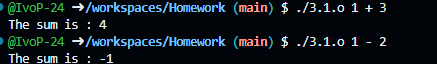

Task 3.2 and 3.3 :
Receives any number of input variables
Using ctype library we make sure every single thing we check from our input is a number
Adds number to total sum
Saves the current number to initialize Minimum and Maximum Variables
Every iteration current number gets compared to minimum and maximum, replacing minimum and maximum variable if one is higher/lower
Count every iteration in a variable
Output Min, Max, Sum and Average by dividing the sum with the count number.
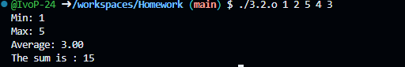

Task 3.4 : 
Receives 3 inputs, number, from base and to base
Does an edge case where it makes sure the inputs meet the usage requirements
Converts and prints in octal, hexadecimal etc.
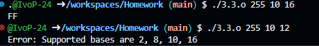

Task 4.1 :
Very similar to calculating sum with numbers but instead it's done with strings
Every string gets it's length checked and saved into a sum variable which is then printed later.

Task 4.2 :
Receives an operator and string/-s as an input
Using strcmp checks 4 times if any operator is inputted, along with a string or strings.
Prints the result.
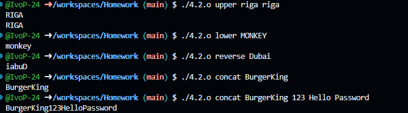

Task 4.3 :
Saves the  words length
Looks for the word in a case insensitive string word search loop
Prints if it's found, if not it prints that it doesn't exist in the string.

Task 5.1 : 
Checks if verbose mode is enabled by user input
Provides verbose input if verbose is enabled
Prints user input
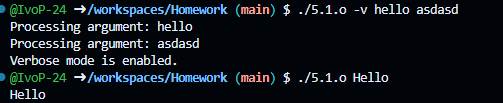

Task 5.2 : 
Using inputted parameters prints number, filename and if verbose is enabled then it notifies.
-v -> Activates verbose mode -n Inputs number -o File input

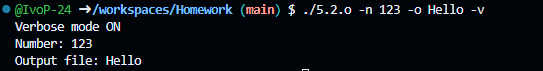

Task 5.3 :
Using strcmp compares each inputted string if it contains any of the commands for an operation
-v -> Activates verbose mode -n Inputs number -o File input
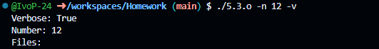

Task 5.4 :
Loops through every input to check for flags
Has an edge case for incorrect flags
-p -> Sets port  -host -> Sets host address(IP)  -d -> enables debug
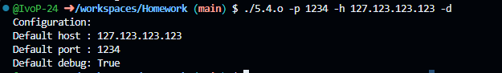

Task 6.1 :
Checks if input has more than one filename
Loops through everything prints it and prints an edge case if it can't open/read it
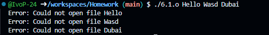
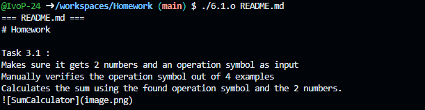

Task 6.2 : 
Checks if input has more than one filename
Prints edgecase if user enters wrong input
Prints filename, its size in bytes, number of lines and number of words
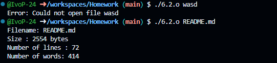

Task 6.3 : 
Checks if there's 2 inputs, if not prints usage edgecase
Receives a word it has to search and file/filenames
Opens file with fopen
Loops through files (if theres more than one)
Reads files line by line searching for the word
If -i, enables case insensitive mode.
If word is found prints file, line and word.
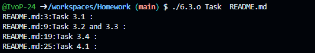

Task 6.4 :
Performs basic file operations COPY MERGE SPLIT
Checks if there's any input from user after file execution
If not prints edge case
Opens file with fopen
Usage: src -> source dst -> destination

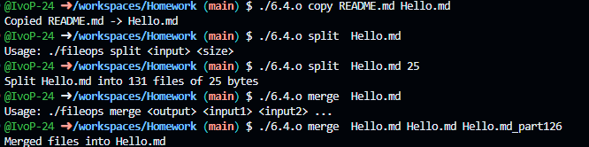

